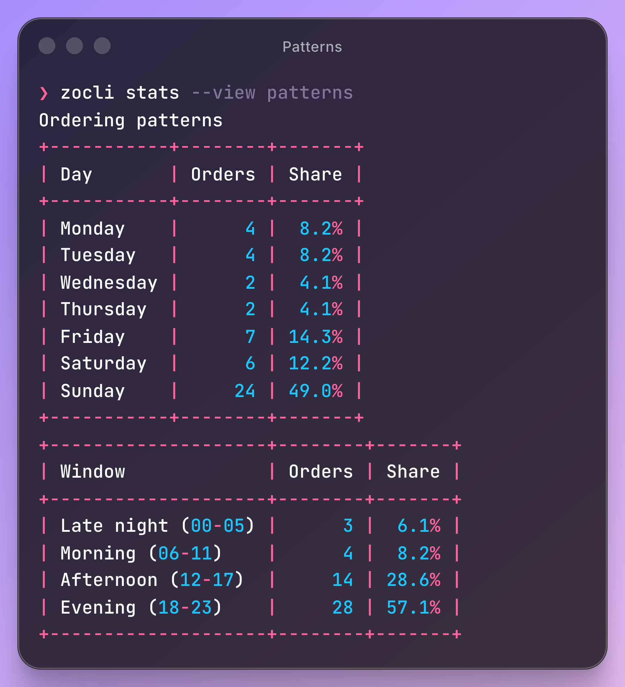
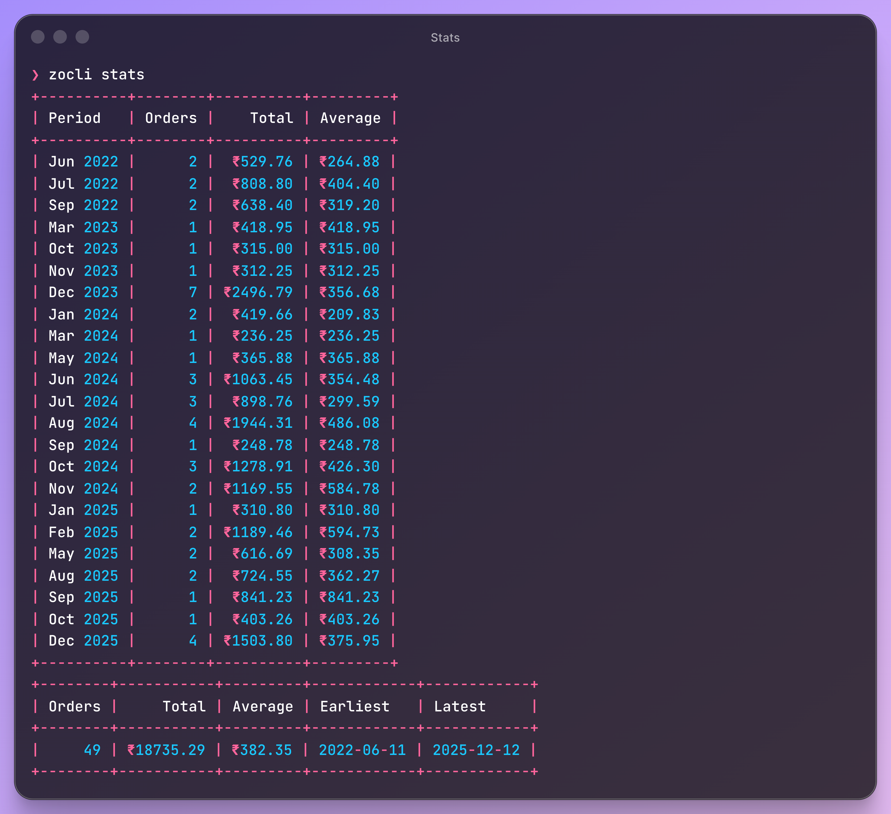
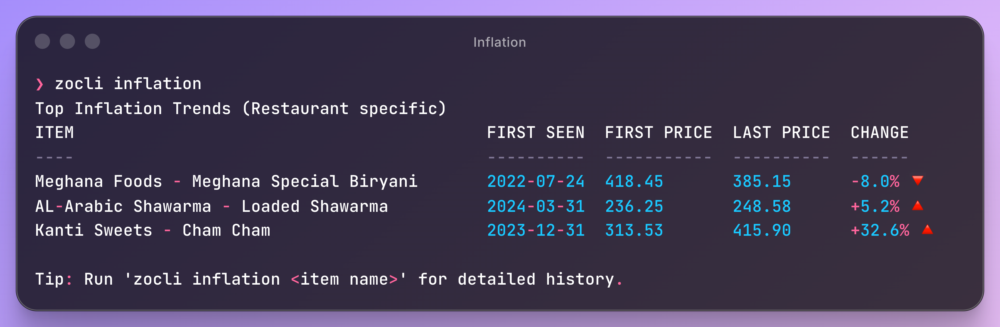

# zocli

A tiny CLI to view and analyze your Zomato order history.

## Install with Homebrew

```bash
brew tap maheshrijal/tap
brew install maheshrijal/tap/zocli
```

## What this is
- A Go CLI for Zomato to check order history, spent amount, tracking etc.

## What this is not
- An official Zomato integration
- A stable API client
- A guarantee of ToS compliance

## Auth

```bash
./zocli auth login
```

See `zocli auth help` for advanced options.

Then sync:

```bash
./zocli sync
```

## Commands

- `auth` — Save your Zomato cookie for future requests
- `auth logout` — Clear the saved cookie
- `auth status` — Check whether your saved cookie is still valid
- `sync` — Fetch orders and store locally (or `--mock`)
- `orders` — List stored orders
- `stats` — Summarize total spend with optional grouping
- `inflation` — Track unit price history for items
- `config` — Show config and cache paths

## Showcase

<table>
  <tr>
    <td width="50%" valign="middle">
      
    </td>
    <td width="50%" valign="middle">
      
    </td>
  </tr>
</table>
<p align="center">
  
</p>

```bash
# View deep spending patterns
./zocli stats --view patterns

# General summary
./zocli stats

# Track item inflation
./zocli inflation "Biryani"
```

## Project layout

```
cmd/zocli          # CLI entrypoint
internal/auth          # Browser-based login
internal/cli           # Usage and help text
internal/config        # Config file handling
internal/store         # Local cache for orders
internal/zomato        # Zomato client + models
internal/stats         # Spending summaries
internal/sample        # Embedded mock orders
```


## Disclaimer
This is an **unofficial** project and is **not affiliated with Zomato**. Please don't sue me 🙏  
Using cookies or reverse-engineered endpoints may violate terms of service. Use at your own risk.
